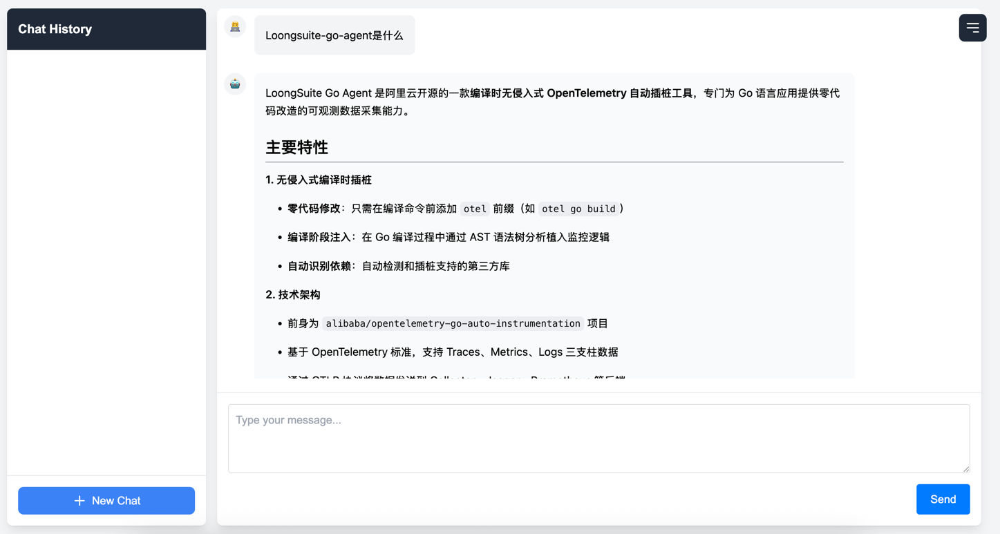
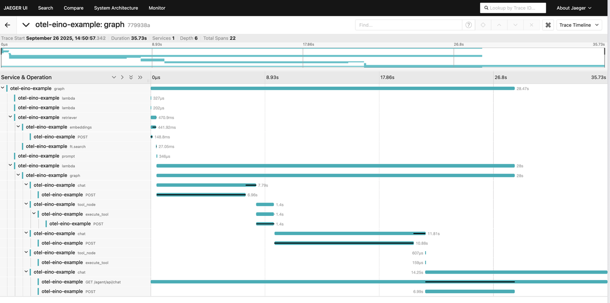
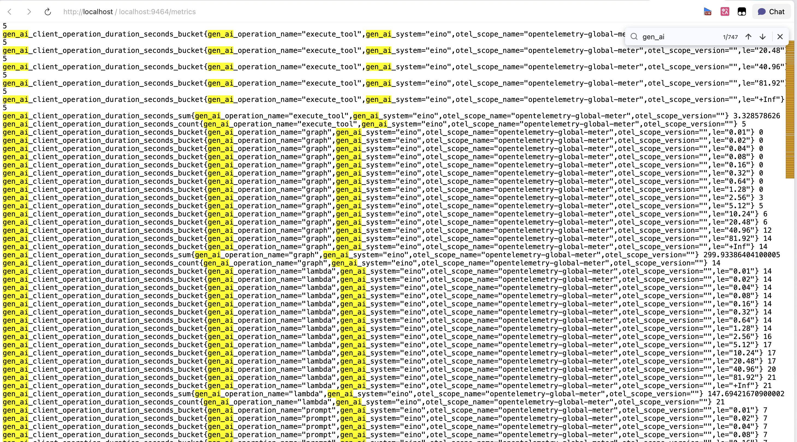
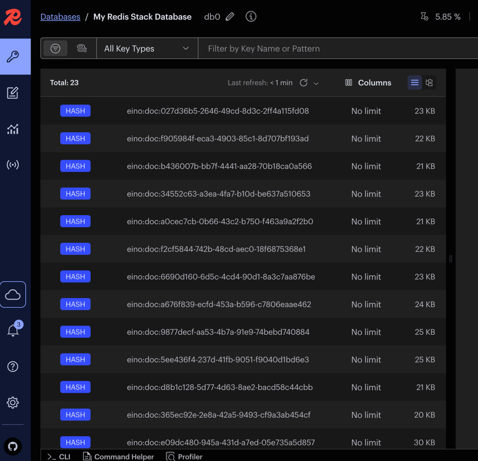

# Eino Demo

## Overview

This is a demonstration project showcasing the use of loongsuite-go-agent with the Eino framework.

## Architecture

This project consists of the following key parts:

- **AI Agent (`einoagent`)**: A web service based on [Hertz](https://github.com/cloudwego/hertz). It provides a simple chat interface using [Eino](https://github.com/cloudwego/eino) to build a React Agent, receives user queries, retrieves relevant information from Redis, and calls the OpenAI model to generate responses.
- **Knowledge Indexing (`knowledgeindexing`)**: A one-time command-line tool. It reads your local Markdown files, calls the OpenAI Embedding API to generate vectors, and stores these vectorized knowledge into Redis Stack.
- **Redis Stack**: Serves as a vector database for storing and efficiently retrieving knowledge base content.
- **Jaeger**: Used for collecting and visualizing distributed tracing data, helping you understand the complete call chain of requests in the system.
- **Prometheus**: Used for collecting and querying application performance metrics.

## Prerequisites

Before starting, please ensure you have the following tools installed in your development environment:

- Go (version 1.18 or higher)
- Docker
- Docker Compose

## Configuration

Before starting the application, you need to configure OpenAI credentials.

1. Create a file named `.env` in the project root directory.
2. Copy the following content into the `.env` file and replace with your own values:

```env
# OpenAI API Key
export OPENAI_API_KEY="sk-..."

# Model for chat
export OPENAI_CHAT_MODEL="gpt-3.5-turbo"
# Chat service address (use default for official OpenAI)
export OPENAI_CHAT_BASE_URL="https://api.openai.com/v1"

# Model for generating embeddings
export OPENAI_EMBEDDING_MODEL="text-embedding-3-small"
# Embedding service address (use default for official OpenAI)
export OPENAI_EMBEDDING_BASE_URL="https://api.openai.com/v1"
```

## Quick Start

Please follow these steps to start and run the entire application.

### Step 1: Start Basic Services

First, use `docker-compose` to start Redis, Jaeger, and Prometheus.

```bash
docker-compose up -d
```

### Step 2: Create and Index Knowledge Base

Run the knowledge indexing program. This program will traverse `[docs](../../docs)` and index all Markdown files into Redis.

```bash
go run ./cmd/knowledgeindexing
```

When you see the `index success` output, it means the knowledge base has been successfully indexed.

### Step 3: Start AI Agent Service

Now you can start the core AI agent service.

```bash
otel go build cmd/einoagent/main.go && ./main
```

The service will start on port `8080` by default.

## How to Use

After the service starts, visit [http://localhost:8080](http://localhost:8080) in your browser.

You will see a simple chat interface. Now you can start asking questions! The AI agent will answer your questions based on the knowledge base content you provided in step two.



## Observability

This project provides rich observability tools to help you monitor and debug the application.

- **Jaeger ([http://localhost:16686](http://localhost:16686))**



- **Metrics ([http://localhost:9464/metrics](http://localhost:9464/metrics))**



- **RedisInsight ([http://localhost:8001](http://localhost:8001))**


